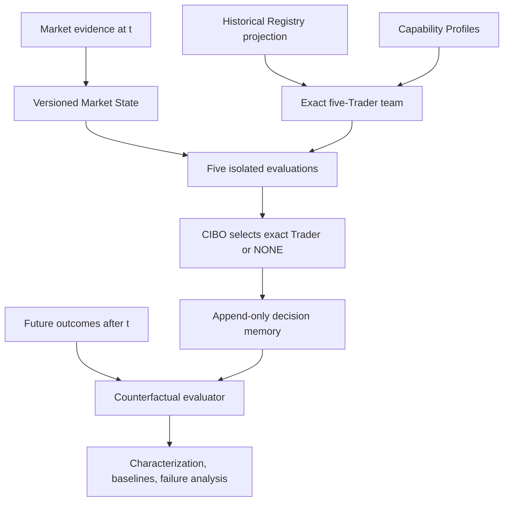

# QORE CIBO Trader-Team Lab 001

## Scope

This component studies CIBO as a market reader and exact-version Trader router.
It consumes, rather than replaces, the existing CIBO capability/team/suitability
contracts, deterministic Trader evaluators and Trader Lab evidence. It creates no
order, Risk decision, broker write, DEMO admission, Production authority or
real-capital authority.

The first cohort is exactly VT-01, VT-08, VT-09, VT-17 and VT-31. The contracts
remain generic at the member, history, evaluator and decision layers; the cohort
builder adds the first-study five-member invariant.

## Authority and information flow

The future-outcome/oracle types are in `trader_team_lab_research.py`; the
decision-time API cannot accept them. This structural split prevents oracle and
lookahead leakage.

## Reused owners

| Existing owner | Use in this component |
|---|---|
| `CiboTraderCapabilityProfile` | Exact capability, evidence, markets, timeframes, freshness and limitations retained in each team member |
| `CiboTraderTeam` | Remains the general CIBO opinion-synthesis surface; this component adds a frozen research cohort, not a replacement team system |
| `assess_market_trader_suitability` | Produces and retains all five functional suitability observations |
| `MarketTraderContext` / Cognitive World Model | Remains the general cognitive market-context owner; `CiboMarketState` is the time-t replay envelope required by the Lab |
| deterministic Trader contracts/evaluators | Exact identity, methodology, output, setup and abstention semantics |
| instrument-bound evaluator | Canonical snapshot-to-Trader adapter and evidence fingerprints |
| Trader Lab | Source of characterization and Historical Intelligence projections; never bypassed for DEMO |

## Contracts

### Decision-time

- `CiboMarketState` retains instrument, market, observation time, information
  cutoff, timeframe/session context, explicit dimensions, regime hypothesis and
  uncertainty, contradictions, unsupported dimensions and provenance.
- `CiboMarketDimension` requires a value and evidence only for `OBSERVED`.
  `UNKNOWN`, `INSUFFICIENT_EVIDENCE` and `CONTRADICTORY` are distinct and cannot
  carry a fabricated neutral value.
- `TraderHistoricalIntelligencePort` is the consume-only seam for
  `HARNESS-ENGINEER-QORE-TRADER-HISTORICAL-INTELLIGENCE-REGISTRY-001`.
- `CiboLabTraderMember` binds one exact Demo Trader identity, exact methodology,
  matching `CiboTraderCapabilityProfile` config and a matching history projection.
- `CiboLabTraderTeam` fingerprints all five exact member versions/configurations,
  profiles, historical projections and formation time.
- `ShadowTraderEvaluator` receives only the same frozen `CiboMarketState`.
  Outputs are checked against the member identity, methodology, cutoff and
  available evidence set.
- `CiboMarketEvidenceAuthorityPort` is a verify-only external seam. A caller
  cannot turn CIBO's public evidence records into an authority-rooted market fact.
- `CiboMetaSelectionDecision` retains policy version, market/team/shadow
  fingerprints, exact selected identity/output or NONE, reasons, all five
  suitability assessments, alternatives, uncertainty, conflicts, cutoff and
  provenance.

### Post-decision

- `TraderCounterfactualOutcome` binds realized return, R multiple, win/loss, MAE,
  MFE, duration, costs, abstention and drawdown contribution to the exact frozen
  Trader output fingerprint.
- `CiboCounterfactualEvaluation` calculates selected, best, worst and NONE
  outcomes, correctness, regret, abstention quality, unnecessary-trade and
  missed-opportunity flags.
- `CiboFailureFamily` separates market understanding, Trader selection, selected
  Trader, regime-change, cost and lucky-profit diagnoses.
- `InMemoryCiboDecisionHistory` is the deterministic reference/fake adapter. It
  appends a decision once and finalizes its future outcome once; neither can be
  overwritten. Durable storage can implement `CiboDecisionHistoryPort`.
- `characterize_cibo` creates slices over market, instrument, regime, session,
  timeframe, selected Trader, direction, uncertainty and an explicit
  `confidence-unsupported` bucket when the Trader contract exposes no genuine
  confidence. Metrics include accuracy/regret, abstention and market-reading
  quality, selection frequency/success, stability/switching, expectancy, profit
  factor, drawdown/tail loss, cost drag and sample sufficiency.
- `compare_baselines` retains the five own-logic baselines, CIBO dynamic,
  CIBO+NONE and the evaluation-only oracle. Abstention outcomes must remain zero.
- `CiboWalkForwardPlan` freezes methodology/policy before the ordered chain:
  REPLAY, TRAIN/RESEARCH, WALK-FORWARD, UNTOUCHED OOS, STRESS, CALIBRATION and
  ECONOMIC EVALUATION. Windows cannot overlap; records cannot move between them
  or change policy version.

## Fail-closed invariants

1. Same Trader code with duplicate membership is rejected.
2. Config, version, methodology, profile, history, evaluator and output must agree.
3. Missing, stale, contradictory or insufficient history blocks a runtime team
   when certified history is required.
4. History and market evidence newer than the decision cutoff are rejected.
5. Every output must be one of the five frozen members and use only named time-t
   evidence.
6. The same market/team/policy/evaluator inputs produce identical fingerprints.
7. The selected output is exact; `NONE` carries no selected output.
8. Future outcomes must postdate the frozen decision and match the exact output
   fingerprints.
9. Oracle data exists only in the post-decision evaluator.
10. Every team, shadow result and selection is permanently `research_only=True`.

## Existing-evaluator adapter

`FirstCohortShadowEvaluatorAdapter` loads canonical `OhlcSnapshot` values from a
read-only `CiboMarketSnapshotPort`, verifies instrument/cutoff/provenance, applies
the established M5/M15 and VT-08 H4 context requirements, invokes the existing
instrument-bound evaluator and checks exact identity again. A snapshot not named
by the frozen market-state provenance fails before evaluation.

## External work still pending

- The Historical Intelligence Registry Harness candidate is not integrated at
  this candidate's base. The Lab therefore provides only the typed consume/verify
  port; runtime must inject the future authoritative adapter. Tests use a
  deterministic fake and do not create a competing registry.
- A durable append-only decision-history adapter is not selected by this scope;
  the port and fully validating in-memory reference adapter are present.
- This work does not activate DEMO, modify Risk, build orders, call brokers or
  change any promotion decision.
- Authentic multi-market runs, statistical conclusions and CIBO policy training
  remain evidence-producing campaigns. The architecture prevents those future
  results from being fabricated in code.

## Acceptance path

With valid adapters/fixtures the executable path is:

`MARKET STATE(t) + exact five-Trader team + history projections`

→ five isolated outputs → deterministic `SELECT exact Trader` or `NONE`

→ append frozen decision → advance time → exact five outcomes

→ counterfactual evaluation → market-reading/selection diagnosis →
characterization/baselines/walk-forward evidence.
